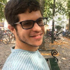

# Hello!
{:style="display: block; width: 200px; height:auto; margin-left: auto; margin-right:40px; float: left;"}

I'm Sam, a postdoctoral research associate at [The University of Manchester](https://www.manchester.ac.uk/"). I work on the [ATLAS experiment](https://atlas.cern/") at the [Large Hadron Collider](https://home.cern/science/accelerators/large-hadron-collider) (LHC), [CERN](https://home.cern/").

Previously, I was a PhD student at [The University of Manchester](https://www.manchester.ac.uk/").
