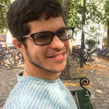
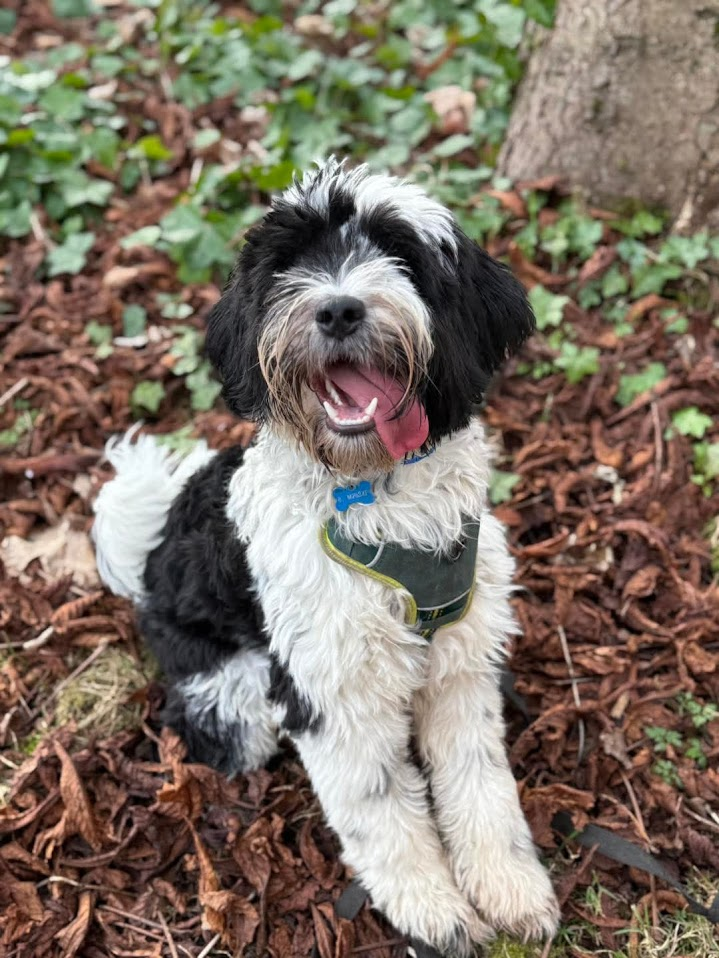

# Hello!
{:style="display: block; width: 200px; height:auto; margin-left: auto; margin-right:40px; float: left;"}

I'm Sam, a data scientist working in hospitality. I have previously worked in the mobility/traffic space, and energy.

I have a background in academia; I was a physicist at [The University of Manchester (UK)](https://www.manchester.ac.uk/), 
where I worked on the [ATLAS experiment](https://atlas.cern/) at the [Large Hadron Collider](https://home.cern/science/accelerators/large-hadron-collider) (LHC), [CERN](https://home.cern/).  
My [thesis is available here](./thesis) if you’re interested.

Sometimes I share thoughts in my [blog](/archive).  
I’m a huge Neovim enthusiast and plan to write posts about integrating it into my workflow. I like to live and work in the terminal whenever I can (yes, I know I’m a bit weird).

## Tools & Tech
I work with a range of tools to explore, analyse, and visualise data:

- **Programming & Data Science:** Python (Pandas, NumPy, Matplotlib, Seaborn), Scikit-learn, TensorFlow
- **Data Workflow:** SQL, Git/GitHub/GitLab (and some previously _very_ old svn usage)
- **Editors & Productivity:** Neovim, LazyGit/NeoGit, tmux, sometimes vscode, and yes...I prefer the IPython REPL with [iron.nvim](https://github.com/Vigemus/iron.nvim) over Jupyter (but that's another story)
- **Operating Systems:** Linux (currently Arch Linux; previously Xubuntu/Ubuntu + XFCE), using Linux almost exclusively since 2017

{:style="float: left; width: 200px; height: auto; margin-right: 20px; margin-bottom: 10px;"}
I enjoy long walks with my excitable [Tibetan Terrier](https://en.wikipedia.org/wiki/Tibetan_Terrier), baking sourdough bread, and playing video games.
I also like caring for my house plants, and tinkering with my [dotfiles](https://github.com/sdysch/dotfiles/) to keep my setups neat and efficient.

Feel free to get in [contact](/contact)!
