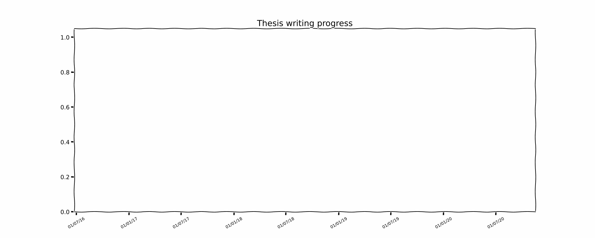

Taken from git commits (insertions - deletions) to my thesis repository, over the course of many months of writing.

The full document, if you are interested, can be found [here](<https://www.research.manchester.ac.uk/portal/en/theses/tau-lepton-identification-and-universality-tests-with-the-atlas-experiment(fbf279c8-05e5-4fc0-b3d6-219d252fd1af).html>),
or [here](https://www.research.manchester.ac.uk/portal/files/213185794/FULL_TEXT.PDF) for a direct pdf link.
